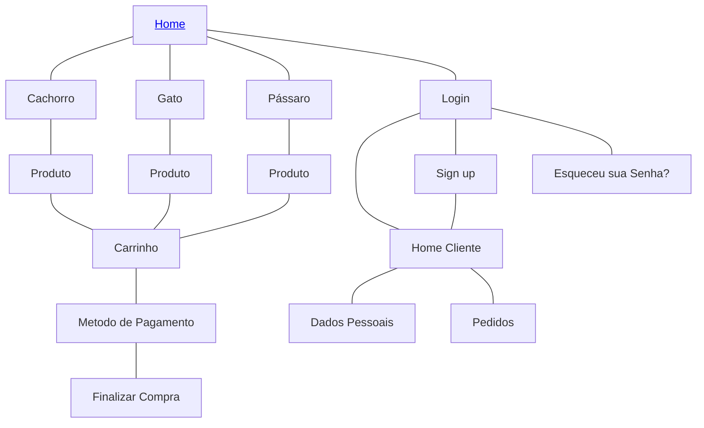

# Computacao Grafica

```mermaid
  graph TD;
      Home[<a href='https://github.com/viniciussm07/pet-shop/blob/main/mockups/mockupCarrinhoDeCompras.png?raw=true'  >Home</a>]---Cachorro;
      Cachorro---produto1[Produto];
      
      Home---Gato;
      Gato---produto2[Produto];
      
      Home---Pássaro;
      Pássaro---produto3[Produto];
      
      Home---login[Login];
      login---homeCliente[Home Cliente]
      login---register[Sign up]
      login---esqueciASenha[Esqueceu sua Senha?];
      register---homeCliente
      homeCliente---dadosPessoais[Dados Pessoais]
      homeCliente---Pedidos
      
      produto1---carrinho[Carrinho]
      produto2---carrinho
      produto3---carrinho
      
      carrinho---metodoDePagamento[Metodo de Pagamento]
      metodoDePagamento---finalizarCompra[Finalizar Compra]
```
